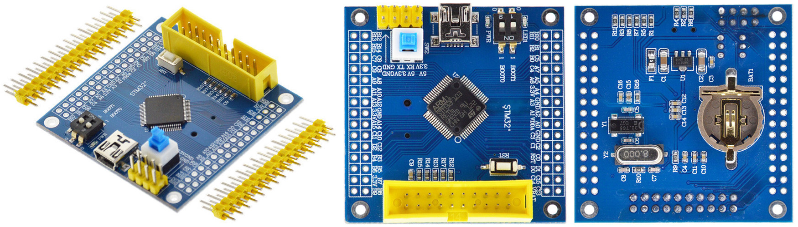

# Blue Button STM32F103RET6

:warning: Work in progress. Depends on STM32F1 support in MicroPython.

MicroPython board definition files for the unbranded blue button STM32F103RET6 dev board.

**Brand:** Unbranded/Generic

**Markings:** STM32°



You can buy one for around $7 USD on [AliExpress](https://www.aliexpress.com/item/STM32F103RET6-ARM-STM32-Minimum-System-Development-Board-Module-For-arduino-Minimum-System-Board-STM32F103C8T6-upgrade-version/32787890975.html)

### Build and deploy the firmware:

:warning: Most likely does not work yet.

* Clone the board definitions to your [MicroPython](https://github.com/micropython/micropython) ports/stm32/boards folder.

```
cd micropython/ports/stm32/boards
git clone https://github.com/mcauser/BLUE_BUTTON_F103RET6.git
```

* Disconnect the board from USB
* Set BOOT0 jumper to ON (BT0->3V3)
* Connect the board via USB

```
cd micropython/ports/stm32
make BOARD=BLUE_BUTTON_F103RET6
make BOARD=BLUE_BUTTON_F103RET6 deploy
```

* Disconnect the board from USB
* Set BOOT0 jumper to OFF (BT0->GND)
* Connect the board via USB

```
$ screen /dev/tty.usbmodem1422
```

### Specifications:

* STM32F103RET6 ARM Cortex M3
* 72MHz, 90 DMIPS / 1.25 DMIPS / MHz
* 2.0V - 3.6V operating voltage
* 8MHz system crystal
* 32.768KHz RTC crystal
* 2.54mm pitch pins
* JTAG/SWD header
* 512 KByte Flash, 64 KByte SRAM
* 3x SPI, 5x USART, 2x I2S, 2x I2C
* 1x SDIO, 2x CAN
* 51 I/Os almost all 5V-tolerant
* 1x USB 2.0 FS
* RTC battery CR1220
* 3x ADC (12-bit / 16-channel)
* 2x DAC (12-bit)
* 3x general timers, 1x advanced timers
* 3.3V LDO voltage regulator, max current 300mA
* Micro USB for power and data
* Blue user LED (PC13)
* 2x jumpers for bootloader selection
* Reset button
* 2x15 side pins + 2x4 top pins
* M3 mounting holes

### Links:

* [STM32F103RE on st.com](http://www.st.com/content/st_com/en/products/microcontrollers/stm32-32-bit-arm-cortex-mcus/stm32-mainstream-mcus/stm32f1-series/stm32f103/stm32f103re.html)
* [Buy on AliExpress](https://www.aliexpress.com/item/STM32F103RET6-ARM-STM32-Minimum-System-Development-Board-Module-For-arduino-Minimum-System-Board-STM32F103C8T6-upgrade-version/32787890975.html) or search for "STM32F103RET6"
* [STM32F103RET6 schematics](https://github.com/mcauser/BLUE_BUTTON_F103RET6/blob/master/docs/STM32F103RET6_schematics.pdf)
* [STM32F103RET6 dimensions](https://github.com/mcauser/BLUE_BUTTON_F103RET6/blob/master/docs/STM32F103RET6_dimensions.pdf)
* [STM32F103RET6 pcb top](https://github.com/mcauser/BLUE_BUTTON_F103RET6/blob/master/docs/STM32F103RET6_top.pdf)
* [STM32F103RET6 pcb bottom](https://github.com/mcauser/BLUE_BUTTON_F103RET6/blob/master/docs/STM32F103RET6_bottom.pdf)
